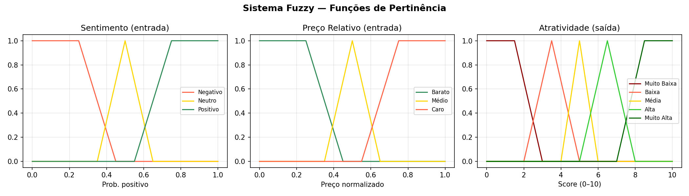
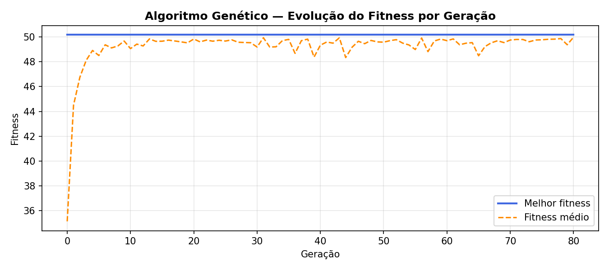

# N2 — Sistema Inteligente de Recomendação de Produtos

**Disciplina:** Inteligência Artificial  
**Professor:** Claudinei Dias (Ney)  
**Instituição:** Centro Universitário Católica de Santa Catarina  

---

## Integrantes

| Nome | RA |
|------|----|
|      |    |
|      |    |
|      |    |
|      |    |
|      |    |

---

## Objetivo

Desenvolver um sistema inteligente capaz de processar avaliações textuais de produtos de e-commerce em português (PT-BR), tratar a incerteza dos dados e otimizar a recomendação de produtos ao usuário final, integrando três técnicas de IA:

1. **PLN + Naive Bayes** — análise de sentimento das avaliações  
2. **Sistema de Inferência Fuzzy (Mamdani)** — cálculo do score de atratividade  
3. **Algoritmo Genético** — seleção da melhor combinação de produtos  

---

## Dataset

**Olist Brazilian E-Commerce** — dataset público disponível no Kaggle com mais de 100.000 pedidos reais de e-commerce brasileiro.

Arquivos utilizados:

| Arquivo | Conteúdo |
|---------|----------|
| `olist_order_reviews_dataset.csv` | Avaliações dos clientes (nota 1–5 e texto livre) |
| `olist_products_dataset.csv` | Catálogo de produtos com categoria |
| `olist_order_items_dataset.csv` | Itens dos pedidos com preço |
| `product_category_name_translation.csv` | Tradução das categorias |

---

## Arquitetura do Sistema

```
  Texto das avaliações (PT-BR)
           │
           ▼
  ┌─────────────────────────┐
  │   CAMADA I — PLN        │  Tokenização · Stop Words PT-BR · Stemming RSLP
  │   Naive Bayes (TF-IDF)  │  Classificação: Positivo / Negativo / Neutro
  └──────────┬──────────────┘
             │ prob_positivo por produto
             ▼
  ┌─────────────────────────┐
  │  CAMADA II — FUZZY      │  Entradas: sentimento + preço relativo por categoria
  │  Mamdani (scikit-fuzzy) │  Saída: Score de Atratividade [0–10]
  └──────────┬──────────────┘
             │ score_fuzzy por produto
             ▼
  ┌─────────────────────────┐
  │  CAMADA III — GA        │  Seleciona combo de 5 produtos
  │  Algoritmo Genético     │  Maximiza score · diversidade · respeita orçamento
  │  (DEAP)                 │
  └──────────┬──────────────┘
             │
             ▼
      Recomendação final (5 produtos)
```

---

## Camada I — PLN + Naive Bayes

### Pré-processamento

1. **Tokenização** — `word_tokenize` do NLTK com idioma português
2. **Remoção de stop words** — lista PT-BR do NLTK (`stopwords.words('portuguese')`)
3. **Stemming** — algoritmo RSLP (*Removedor de Sufixos da Língua Portuguesa*), específico para o idioma
4. **Vetorização** — TF-IDF com até 5.000 features e bigramas (1, 2)

### Rotulagem

A nota de 1 a 5 é convertida em sentimento:

| Nota | Sentimento |
|------|-----------|
| 1–2  | Negativo  |
| 3    | Neutro    |
| 4–5  | Positivo  |

### Resultados (conjunto de teste — 20%)

| Classe | Precision | Recall | F1-Score |
|--------|-----------|--------|----------|
| Negativo | 0.73 | 0.87 | 0.79 |
| Neutro   | 0.31 | 0.08 | 0.12 |
| Positivo | 0.91 | 0.92 | 0.91 |
| **Acurácia geral** | | | **84%** |

> O desempenho menor na classe Neutro é esperado: "neutro" é subjetivo e os textos de nota 3 muitas vezes contêm linguagem ambígua, com aspectos positivos e negativos misturados.

A saída desta camada é a **probabilidade média de sentimento positivo** por produto, calculada sobre todas as suas avaliações.

---

## Camada II — Sistema de Inferência Fuzzy

### Variáveis e Funções de Pertinência

**Entrada 1 — Sentimento** (probabilidade de sentimento positivo, intervalo [0, 1])

| Termo linguístico | Tipo | Parâmetros |
|-------------------|------|-----------|
| Negativo | Trapezoidal | [0, 0, 0.25, 0.45] |
| Neutro   | Triangular  | [0.35, 0.50, 0.65] |
| Positivo | Trapezoidal | [0.55, 0.75, 1.0, 1.0] |

**Entrada 2 — Preço Relativo** (normalizado min-max dentro de cada categoria, intervalo [0, 1])

| Termo linguístico | Tipo | Parâmetros |
|-------------------|------|-----------|
| Barato | Trapezoidal | [0, 0, 0.25, 0.45] |
| Médio  | Triangular  | [0.35, 0.50, 0.65] |
| Caro   | Trapezoidal | [0.55, 0.75, 1.0, 1.0] |

**Saída — Atratividade** (score de atratividade, intervalo [0, 10])

| Termo linguístico | Tipo | Parâmetros |
|-------------------|------|-----------|
| Muito Baixa | Trapezoidal | [0, 0, 1.5, 3.0] |
| Baixa       | Triangular  | [2.0, 3.5, 5.0] |
| Média        | Triangular  | [4.0, 5.0, 6.0] |
| Alta         | Triangular  | [5.0, 6.5, 8.0] |
| Muito Alta  | Trapezoidal | [7.0, 8.5, 10, 10] |

### Base de Regras (Mamdani)

| SE sentimento... | E preço... | ENTÃO atratividade... |
|-----------------|------------|-----------------------|
| Positivo | Barato | Muito Alta |
| Positivo | Médio  | Alta |
| Positivo | Caro   | Média |
| Neutro   | Barato | Alta |
| Neutro   | Médio  | Média |
| Neutro   | Caro   | Baixa |
| Negativo | Barato | Baixa |
| Negativo | Médio  | Muito Baixa |
| Negativo | Caro   | Muito Baixa |



---

## Camada III — Algoritmo Genético

### Configuração

| Parâmetro | Valor |
|-----------|-------|
| Tamanho da população | 100 indivíduos |
| Número de gerações | 80 |
| Probabilidade de crossover | 80% |
| Probabilidade de mutação | 20% |
| Seleção | Torneio (k=4) |
| Crossover | Dois pontos com preservação de unicidade |
| Tamanho do indivíduo | 5 produtos |
| Orçamento máximo | R$ 1.000,00 |

### Representação

Cada **indivíduo** é uma lista de 5 índices únicos do catálogo de produtos (sem repetição).

### Função de Fitness

```
fitness = Σ(score_fuzzy) + bônus_diversidade − penalidade_orçamento

bônus_diversidade = 1.5 × (n_categorias_distintas − 1)
penalidade_orçamento = max(0, custo_total − R$1.000) × 0.05
```

O bônus de diversidade incentiva o GA a recomendar produtos de categorias diferentes, evitando recomendações redundantes.

### Resultados



| Produto (ID) | Categoria | Preço (R$) | Sentimento (prob+) | Score Fuzzy |
|-------------|-----------|-----------|-------------------|-------------|
| `9b76503b...` | cama_mesa_banho            | 108,99 | 0.94 | 8.83 |
| `72b61ed0...` | esporte_lazer              |  59,90 | 1.00 | 8.83 |
| `b8748a4a...` | perfumaria                 |  19,90 | 0.98 | 8.83 |
| `13797c37...` | fashion_bolsas_e_acessorios|  20,30 | 0.96 | 8.83 |
| `15964f24...` | ferramentas_jardim         |  44,99 | 0.99 | 8.83 |
| **Total** | **5 categorias distintas** | **R$ 254,08** | — | **44,17** |

---

## Como Executar

### 1. Pré-requisitos

- Python 3.10+
- Dataset Olist na pasta `data/`

### 2. Instalar dependências

```bash
python3 -m venv .venv
source .venv/bin/activate        # Linux/Mac
# .venv\Scripts\activate         # Windows

pip install -r requirements.txt
```

### 3. Executar o pipeline completo

```bash
python main.py
```

### 4. Executar camadas individualmente

```bash
# Apenas Camada I
python src/layer1_nlp.py

# Apenas Camada II (requer saída da I)
python src/layer2_fuzzy.py

# Apenas Camada III (requer saída da II)
python src/layer3_ga.py
```

### 5. Arquivos gerados em `results/`

| Arquivo | Descrição |
|---------|-----------|
| `modelo_nb.pkl` | Modelo Naive Bayes treinado |
| `sentimento_produtos.csv` | Probabilidade de sentimento por produto |
| `catalogo_fuzzy.csv` | Catálogo com score fuzzy de cada produto |
| `recomendacao_final.csv` | 5 produtos recomendados pelo GA |
| `fuzzy_pertinencia.png` | Gráfico das funções de pertinência |
| `ga_evolucao.png` | Curva de evolução do fitness por geração |

---

## Estrutura do Projeto

```
n2-ia/
├── data/                          # Dataset Olist (não versionado)
│   ├── olist_order_reviews_dataset.csv
│   ├── olist_products_dataset.csv
│   ├── olist_order_items_dataset.csv
│   └── product_category_name_translation.csv
├── src/
│   ├── layer1_nlp.py              # Camada I: PLN + Naive Bayes
│   ├── layer2_fuzzy.py            # Camada II: Sistema Fuzzy Mamdani
│   └── layer3_ga.py               # Camada III: Algoritmo Genético
├── results/                       # Saídas geradas (gerado automaticamente)
├── main.py                        # Pipeline integrador
├── requirements.txt               # Dependências Python
└── README.md                      # Este arquivo
```

---

## Tecnologias Utilizadas

| Biblioteca | Finalidade |
|------------|-----------|
| `scikit-learn` | Naive Bayes, TF-IDF, métricas de avaliação |
| `nltk` | Tokenização, stop words PT-BR, stemming RSLP |
| `scikit-fuzzy` | Sistema de inferência fuzzy Mamdani |
| `deap` | Framework para algoritmos evolutivos |
| `pandas` | Manipulação e análise dos dados |
| `numpy` | Operações numéricas |
| `matplotlib` | Visualizações e gráficos |

---

## Referências

- OLIST. *Brazilian E-Commerce Public Dataset by Olist*. Kaggle, 2018. Disponível em: kaggle.com/datasets/olistbr/brazilian-ecommerce  
- MITCHELL, T. M. *Machine Learning*. McGraw-Hill, 1997.  
- ZADEH, L. A. Fuzzy sets. *Information and Control*, v. 8, n. 3, p. 338–353, 1965.  
- HOLLAND, J. H. *Adaptation in Natural and Artificial Systems*. MIT Press, 1992.  
- ORENGO, V. M.; HUYCK, C. A stemming algorithm for the Portuguese language. *SPIRE*, 2001.  
- FORTIN, F. et al. DEAP: Evolutionary Algorithms Made Easy. *JMLR*, v. 13, p. 2171–2175, 2012.
